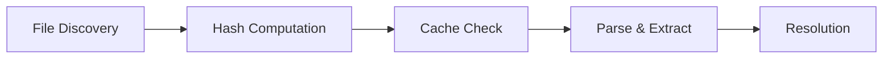

## Overview

Envark's scanning engine intelligently traverses your project directory to detect environment variable usage in source code and `.env` files. The scanner supports multiple programming languages, caches results for performance, and provides detailed usage tracking.

## Quick Start

```bash
# Scan current directory
envark scan

# Scan specific project
envark scan /path/to/project

# Filter results
envark scan --filter missing
```

## How It Works

The scanning process follows a four-stage pipeline:



### 1. File Discovery

Envark walks your project directory and identifies relevant files:

- **Source Files**: `.js`, `.ts`, `.jsx`, `.tsx`, `.py`, `.rb`, `.go`, `.php`, etc.
- **Environment Files**: `.env`, `.env.local`, `.env.development`, `.env.example`, etc.
- **Configuration Files**: `config/`, environment-specific configs

<Note>
Envark automatically skips `node_modules/`, `.git/`, `dist/`, `build/`, and other common ignored directories for performance.
</Note>

### 2. Hash Computation

Before parsing, Envark computes a hash of all discovered files to enable intelligent caching:

```typescript
// From src/core/scanner.ts:76
const hash = computeFilesHash(allFiles);
```

This allows Envark to skip re-scanning if nothing has changed since the last run.

### 3. Cache Check

Envark maintains a cache at `~/.envark/cache/` to speed up subsequent scans:

```typescript
// From src/core/scanner.ts:79-95
if (useCache) {
    const cached = readCache(normalizedPath, hash);
    if (cached.hit && cached.data) {
        return {
            // Return cached scan results
            cacheHit: true,
            duration: Date.now() - startTime,
            // ...
        };
    }
}
```

<Accordion title="Cache Performance Benefits">
  For a typical project:
  - **First scan**: 2-5 seconds
  - **Cached scan**: 50-200ms (10-100x faster)

  Cache is automatically invalidated when files change.
</Accordion>

### 4. Parse & Extract

For each source file, Envark uses regex-based parsers to detect environment variable access patterns:

#### JavaScript/TypeScript Patterns

```javascript
// process.env.VARIABLE_NAME
process.env.API_KEY
process.env['DATABASE_URL']
process.env["SECRET_KEY"]

// import.meta.env (Vite)
import.meta.env.VITE_API_URL
import.meta.env.VITE_PUBLIC_KEY

// Destructuring
const { PORT, HOST } = process.env;
```

#### Python Patterns

```python
# os.getenv
import os
os.getenv('DATABASE_URL')
os.getenv("API_KEY", "default")
os.environ['SECRET_KEY']
os.environ.get('PORT')

# python-dotenv
from dotenv import load_dotenv
```

#### Environment File Patterns

```bash
# Standard .env format
DATABASE_URL=postgresql://localhost/db
API_KEY="sk-1234567890abcdef"
PORT=3000

# Export syntax (shell)
export NODE_ENV=production
```

### 5. Resolution

After extraction, Envark resolves the complete picture for each variable:

- Where it's **defined** (which .env files)
- Where it's **used** (which source files and line numbers)
- Whether it has **default values** in code
- If it's **documented** (.env.example)
- If it's **missing** or **unused**

## Scan Options

### Configuration

```typescript
// From src/core/scanner.ts:11-15
export interface ScanOptions {
    maxFiles?: number;      // Default: 10000
    maxDepth?: number;      // Default: 50
    useCache?: boolean;     // Default: true
}
```

### CLI Usage

```bash
# Disable caching
envark scan --no-cache

# Limit file count (for huge monorepos)
envark scan --max-files 5000

# Limit directory depth
envark scan --max-depth 10
```

## Filters

Filter scan results to focus on specific issues:

<Tabs>
  <Tab title="All">
    **Show everything** (default)

    ```bash
    envark scan
    envark scan --filter all
    ```

    Returns all discovered environment variables.
  </Tab>

  <Tab title="Missing">
    **Only undefined variables**

    ```bash
    envark scan --filter missing
    ```

    Shows variables that are:
    - Used in code
    - Not defined in any .env file
    - Have no default value

    Critical for finding configuration gaps.
  </Tab>

  <Tab title="Unused">
    **Only dead variables**

    ```bash
    envark scan --filter unused
    ```

    Shows variables that are:
    - Defined in .env files
    - Never referenced in code

    Helps clean up configuration files.
  </Tab>

  <Tab title="Risky">
    **Only high-risk variables**

    ```bash
    envark scan --filter risky
    ```

    Shows variables with:
    - Risk level: Critical or High
    - Security concerns
    - Configuration issues
  </Tab>

  <Tab title="Undocumented">
    **Only missing from .env.example**

    ```bash
    envark scan --filter undocumented
    ```

    Shows variables that:
    - Exist in .env or code
    - Not documented in .env.example

    Maintains team documentation standards.
  </Tab>
</Tabs>

## Scan Output

### Summary Section

```bash
┌─ SCAN SUMMARY ────────────────────────────────────────────┐
│  Total: 42  Defined: 38  Missing: 4  Critical: 2
└──────────────────────────────────────────────────────────┘
```

The summary provides:
- **Total**: All unique environment variables found
- **Defined**: Variables with values in .env files
- **Missing**: Variables used but not defined
- **Critical**: Variables with critical risk level

### Variable Details

```bash
Variables:
  DATABASE_URL              [CRITICAL] ✓
  API_KEY                   [HIGH] ✗
  PORT                      [LOW] ✓
  NODE_ENV                  [INFO] ✓
  ...
```

Each variable shows:
- **Name**: The environment variable identifier
- **Risk Level**: Security/configuration risk assessment
- **Status**: ✓ defined, ✗ missing

### Detailed View

For more information, use specific commands:

```bash
# See where a variable is used
envark usage DATABASE_URL

# Analyze risks
envark risk

# Check for missing variables
envark missing
```

## Supported Languages

Envark's scanner detects environment variables in:

<CardGroup cols={3}>
  <Card title="JavaScript" icon="js">
    - Node.js
    - React
    - Vue.js
    - Next.js
    - Express
  </Card>

  <Card title="TypeScript" icon="code">
    - All JS frameworks
    - Deno
    - NestJS
    - Angular
  </Card>

  <Card title="Python" icon="python">
    - Django
    - Flask
    - FastAPI
    - os.getenv
    - python-dotenv
  </Card>

  <Card title="Ruby" icon="gem">
    - Rails
    - Sinatra
    - ENV[]
  </Card>

  <Card title="Go" icon="code">
    - os.Getenv
    - godotenv
  </Card>

  <Card title="PHP" icon="php">
    - Laravel
    - $_ENV
    - getenv()
  </Card>
</CardGroup>

## Framework Detection

Envark recognizes framework-specific patterns:

### Vite/Vite-based Frameworks

```javascript
// Vite requires VITE_ prefix for public vars
import.meta.env.VITE_API_URL  ✓ Detected
import.meta.env.SECRET_KEY    ⚠ Warning: Not accessible (missing VITE_ prefix)
```

### Next.js

```javascript
// Next.js public variables
process.env.NEXT_PUBLIC_API_URL  ✓ Detected

// Server-side only
process.env.DATABASE_URL         ✓ Detected (server)
```

### Create React App

```javascript
// CRA requires REACT_APP_ prefix
process.env.REACT_APP_API_URL    ✓ Detected
```

### Django

```python
# Django settings.py patterns
from decouple import config
config('DATABASE_URL')            ✓ Detected
```

## Performance Characteristics

<CardGroup cols={2}>
  <Card title="Small Projects" icon="gauge-simple-low">
    **< 100 files**

    - First scan: ~500ms
    - Cached: ~50ms
  </Card>

  <Card title="Medium Projects" icon="gauge-simple">
    **100-1000 files**

    - First scan: 1-3s
    - Cached: 100-200ms
  </Card>

  <Card title="Large Projects" icon="gauge-simple-high">
    **1000-5000 files**

    - First scan: 3-8s
    - Cached: 200-500ms
  </Card>

  <Card title="Monorepos" icon="gauge">
    **5000+ files**

    - First scan: 8-20s
    - Cached: 500ms-1s
    - Consider `--max-files`
  </Card>
</CardGroup>

## Ignored Directories

Envark automatically skips these common directories:

```
node_modules/
.git/
.next/
.nuxt/
dist/
build/
out/
coverage/
.cache/
__pycache__/
venv/
.venv/
vendor/
target/
```

<Accordion title="Custom Ignore Patterns">
  Add a `.envarkignore` file to your project root:

  ```
  # .envarkignore
  legacy/
  temp/
  *.backup
  old-configs/
  ```

  This works like `.gitignore` for scanning.
</Accordion>

## Programmatic Usage

Use the scanner in your own tools:

```typescript
import { scanProject } from 'envark';

const result = scanProject('/path/to/project', {
    maxFiles: 10000,
    maxDepth: 50,
    useCache: true
});

console.log(`Found ${result.usages.length} environment variable usages`);
console.log(`Scanned ${result.scannedFiles} files in ${result.duration}ms`);
console.log(`Cache hit: ${result.cacheHit}`);
```

## Cache Management

```bash
# View cache location
envark cache info

# Clear cache
envark cache clear

# Disable cache for a single scan
envark scan --no-cache
```

Cache location: `~/.envark/cache/`

## Troubleshooting

<AccordionGroup>
  <Accordion title="Scan is too slow">
    **Solutions:**
    1. Reduce `--max-files` for huge monorepos
    2. Ensure cache is enabled (default)
    3. Add `.envarkignore` to skip unnecessary directories
    4. Check for slow disk I/O (network drives, encrypted volumes)
  </Accordion>

  <Accordion title="Missing variables in scan">
    **Possible causes:**
    1. Variable accessed using dynamic keys: `process.env[key]`
    2. Custom environment loading logic
    3. Variables loaded from external sources (Vault, AWS Secrets Manager)
    4. Unsupported language/framework pattern

    Use `envark usage <VAR_NAME>` to verify detection.
  </Accordion>

  <Accordion title="False positives">
    **Common scenarios:**
    1. Commented-out code still detected
    2. String literals that look like env vars: `"process.env.API_KEY"`
    3. Documentation or example code

    These are usually low-risk and can be ignored or documented.
  </Accordion>
</AccordionGroup>

## Implementation Details

The scanner is implemented across multiple modules:

- **`src/core/scanner.ts`**: Main scanning orchestration
- **`src/core/parser.ts`**: Language-specific parsers
- **`src/core/resolver.ts`**: Variable resolution logic
- **`src/utils/file-walker.ts`**: Efficient directory traversal
- **`src/utils/cache.ts`**: Caching layer

See `src/core/scanner.ts:62-134` for the main scan implementation.