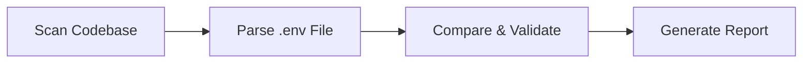

## Overview

Envark's validation feature ensures your `.env` files contain all the environment variables your code actually uses, with proper values. It catches configuration errors before deployment by comparing your `.env` files against real code usage.

## Quick Start

```bash
# Validate default .env file
envark validate

# Validate specific file
envark validate .env.production

# Validate relative to project directory
envark validate ../config/.env --project /path/to/project
```

## How Validation Works

Validation follows a three-step process:



### 1. Scan Codebase

Envark scans your project to discover all environment variables used in code:

```typescript
// From src/tools/validate_env_file.ts:123-126
const scanResult = scanProject(projectPath);
const resolved = resolveEnvMap(scanResult.usages);
```

### 2. Parse .env File

Parse the target `.env` file to extract defined variables:

```typescript
// From src/tools/validate_env_file.ts:74-99
function parseEnvFileContent(content: string): Map<string, string> {
    const vars = new Map<string, string>();

    for (const line of content.split('\n')) {
        const trimmed = line.trim();

        // Skip comments and empty lines
        if (!trimmed || trimmed.startsWith('#')) continue;

        // Parse KEY=VALUE
        const match = trimmed.match(/^(?:export\s+)?([A-Z][A-Z0-9_]*)=(.*)$/);
        if (match && match[1]) {
            let value = match[2] || '';

            // Remove quotes
            if ((value.startsWith('"') && value.endsWith('"')) ||
                (value.startsWith("'") && value.endsWith("'"))) {
                value = value.slice(1, -1);
            }

            vars.set(match[1], value);
        }
    }

    return vars;
}
```

### 3. Compare & Validate

Cross-reference to identify issues:

- **Missing Variables**: Used in code but not in .env
- **Unused Variables**: In .env but never used
- **Empty Values**: Variables with no value
- **Placeholder Values**: Variables with dummy values

## Validation Statuses

<CardGroup cols={3}>
  <Card title="Pass" icon="circle-check" color="#22c55e">
    Variable is properly configured:
    - Present in .env file
    - Has a real value
    - Used in code
  </Card>

  <Card title="Warning" icon="triangle-exclamation" color="#f59e0b">
    Non-critical issue:
    - Defined but not used
    - Missing but has default value
    - Informational notices
  </Card>

  <Card title="Fail" icon="circle-xmark" color="#ef4444">
    Critical problem:
    - Missing from .env
    - Empty value
    - Placeholder value
  </Card>
</CardGroup>

## Validation Checks

### Missing Variables

Variables used in code but not defined in the .env file:

```typescript
// From src/tools/validate_env_file.ts:186-207
for (const varName of usedInCode) {
    if (!envVars.has(varName)) {
        // Check if it has a default value in code
        const variable = resolved.variables.get(varName);
        if (variable && !variable.hasDefault) {
            failed.push({
                variable: varName,
                status: 'fail',
                issue: 'Used in code but missing from env file',
                suggestion: 'Add this variable to your env file'
            });
        } else if (variable?.hasDefault) {
            warnings.push({
                variable: varName,
                status: 'warning',
                issue: 'Used in code but missing from env file (has default)',
                suggestion: 'Consider adding explicitly for clarity'
            });
        }
    }
}
```

**Example:**

```javascript
// src/config.ts
const dbUrl = process.env.DATABASE_URL;  // ✗ FAIL: Missing from .env
```

### Unused Variables

Variables defined in .env but never referenced in code:

```typescript
// From src/tools/validate_env_file.ts:141-151
if (!usedInCode.has(varName)) {
    warnings.push({
        variable: varName,
        status: 'warning',
        issue: 'Defined in env file but never used in code',
        suggestion: "Remove if not needed, or verify it's used indirectly",
        value: value.length > 20 ? value.slice(0, 20) + '...' : value
    });
    continue;
}
```

**Example:**

```bash
# .env
OLD_API_KEY=abc123  # ⚠ WARNING: Not used anywhere
```

### Empty Values

Variables with no value assigned:

```typescript
// From src/tools/validate_env_file.ts:154-163
if (value.trim() === '') {
    failed.push({
        variable: varName,
        status: 'fail',
        issue: 'Empty value',
        suggestion: 'Set a valid value or remove if not needed',
        value: '(empty)'
    });
    continue;
}
```

**Example:**

```bash
# .env
API_KEY=        # ✗ FAIL: Empty value
DEBUG_MODE=""   # ✗ FAIL: Empty string
```

### Placeholder Values

Variables with obvious dummy values that need replacement:

```typescript
// From src/tools/validate_env_file.ts:50-61
const PLACEHOLDER_PATTERNS = [
    /^changeme$/i,
    /^your[_-]?(key|token|secret|password)/i,
    /^xxx+$/i,
    /^todo$/i,
    /^fixme$/i,
    /^replace[_-]?me$/i,
    /^placeholder$/i,
    /^<.*>$/,
    /^\[.*\]$/,
    /^example$/i,
];

function isPlaceholder(value: string): boolean {
    return PLACEHOLDER_PATTERNS.some(p => p.test(value.trim()));
}
```

**Detected Placeholders:**

<Tabs>
  <Tab title="Common">
    ```bash
    API_KEY=changeme
    SECRET=your-key-here
    TOKEN=your_token_here
    PASSWORD=xxx
    ```
  </Tab>

  <Tab title="TODO/FIXME">
    ```bash
    DATABASE_URL=todo
    API_ENDPOINT=fixme
    SECRET_KEY=replace-me
    ```
  </Tab>

  <Tab title="Brackets">
    ```bash
    API_KEY=<your-api-key>
    TOKEN=[your-token]
    URL=<insert-url-here>
    ```
  </Tab>

  <Tab title="Generic">
    ```bash
    SECRET=placeholder
    KEY=example
    VALUE=test
    ```
  </Tab>
</Tabs>

## Validation Output

### CLI Output

```bash
$ envark validate .env

┌─ VALIDATION ──────────────────────────────────────────────┐
│  Status: ✗ INVALID
│  Passed: 35  Warnings: 3  Failed: 4
└──────────────────────────────────────────────────────────┘

✓ PASSED (35)
  DATABASE_URL              postgresql://...
  API_KEY                   sk-abc...
  PORT                      3000
  ...

⚠ WARNINGS (3)
  OLD_FEATURE_FLAG          Defined but never used in code
  LEGACY_API_URL            Defined but never used in code
  BACKUP_ENABLED            Missing from file (has default)

✗ FAILED (4)
  SECRET_KEY                Empty value
  STRIPE_KEY                Placeholder: "your-key-here"
  DATABASE_PASSWORD         Missing from env file
  REDIS_URL                 Missing from env file

RECOMMENDATIONS:
  • Set a value for SECRET_KEY
  • Replace placeholder in STRIPE_KEY with actual key
  • Add DATABASE_PASSWORD and REDIS_URL to .env
  • Consider removing unused OLD_FEATURE_FLAG and LEGACY_API_URL
```

### TUI Output

```bash
# In interactive mode
/validate .env
v .env.production
```

### JSON Output

```bash
$ envark validate --json
```

```json
{
  "valid": false,
  "envFilePath": ".env",
  "results": {
    "passed": [
      {
        "variable": "DATABASE_URL",
        "status": "pass",
        "value": "postgresql://..."
      }
    ],
    "warnings": [
      {
        "variable": "OLD_FEATURE_FLAG",
        "status": "warning",
        "issue": "Defined in env file but never used in code",
        "suggestion": "Remove if not needed"
      }
    ],
    "failed": [
      {
        "variable": "SECRET_KEY",
        "status": "fail",
        "issue": "Empty value",
        "suggestion": "Set a valid value"
      }
    ]
  },
  "summary": {
    "total": 42,
    "passed": 35,
    "warnings": 3,
    "failed": 4,
    "unusedInFile": 2,
    "missingFromFile": 2
  }
}
```

## Validation Result Structure

```typescript
// From src/tools/validate_env_file.ts:25-47
export interface ValidateEnvFileOutput {
    valid: boolean;                    // Overall pass/fail
    envFilePath: string;               // Path to validated file
    results: {
        passed: ValidationEntry[];     // Variables that passed
        warnings: ValidationEntry[];   // Non-critical issues
        failed: ValidationEntry[];     // Critical failures
    };
    summary: {
        total: number;                 // Total vars in .env
        passed: number;                // Count passed
        warnings: number;              // Count warnings
        failed: number;                // Count failed
        unusedInFile: number;          // Defined but unused
        missingFromFile: number;       // Used but not defined
    };
    metadata: {
        projectPath: string;
        scannedFiles: number;
        cacheHit: boolean;
        duration: number;
    };
}
```

## Use Cases

### Pre-Deployment Validation

```bash
#!/bin/bash
# deploy.sh

echo "Validating environment configuration..."
envark validate .env.production --fail-on-errors

if [ $? -eq 0 ]; then
    echo "✓ Environment validated successfully"
    npm run build
    npm run deploy
else
    echo "✗ Environment validation failed"
    exit 1
fi
```

### Multiple Environment Validation

```bash
# Validate all environment files
envark validate .env
envark validate .env.development
envark validate .env.staging
envark validate .env.production
```

### CI/CD Integration

```yaml
# .github/workflows/validate-env.yml
name: Validate Environment Files

on:
  push:
    paths:
      - '.env*'
      - 'src/**'

jobs:
  validate:
    runs-on: ubuntu-latest
    steps:
      - uses: actions/checkout@v3
      
      - name: Install Envark
        run: npm install -g envark
      
      - name: Validate Development Environment
        run: envark validate .env.example
      
      - name: Check for Critical Issues
        run: |
          envark validate .env.example --json > validation.json
          FAILED=$(jq '.summary.failed' validation.json)
          if [ "$FAILED" -gt 0 ]; then
            echo "❌ Found $FAILED critical validation issues"
            exit 1
          fi
```

### Docker Build Validation

```dockerfile
# Dockerfile
FROM node:18-alpine

WORKDIR /app

# Install Envark
RUN npm install -g envark

# Copy source and env files
COPY . .

# Validate before building
RUN envark validate .env.production --fail-on-errors

# Build application
RUN npm run build

CMD ["npm", "start"]
```

## CLI Options

```bash
envark validate [env-file] [options]

Options:
  --project <path>        Project directory to scan (default: current directory)
  --fail-on-errors        Exit with code 1 if validation fails
  --fail-on-warnings      Exit with code 1 if warnings found
  --json                  Output results as JSON
  --quiet                 Only show summary
  --verbose               Show detailed information
```

## Programmatic Usage

```typescript
import { validateEnvFile } from 'envark';

const result = await validateEnvFile({
    envFilePath: '.env.production',
    projectPath: '/path/to/project'
});

if (!result.valid) {
    console.error('Validation failed!');
    
    // Log critical failures
    for (const failure of result.results.failed) {
        console.error(`✗ ${failure.variable}: ${failure.issue}`);
        console.error(`  Suggestion: ${failure.suggestion}`);
    }
    
    process.exit(1);
}

console.log(`✓ All ${result.summary.passed} variables validated successfully`);
```

## Best Practices

<CardGroup cols={2}>
  <Card title="Validate Before Deploy" icon="shield-check">
    Always validate production .env files before deployment to catch configuration errors early.
  </Card>

  <Card title="Use .env.example" icon="file-lines">
    Maintain .env.example as a template and validate it in CI to ensure documentation is current.
  </Card>

  <Card title="Environment Parity" icon="clone">
    Validate all environment files (.env.development, .env.staging, .env.production) to ensure consistency.
  </Card>

  <Card title="Automate Checks" icon="robot">
    Add validation to CI/CD pipelines, pre-commit hooks, and deployment scripts.
  </Card>
</CardGroup>

## Common Issues and Solutions

<AccordionGroup>
  <Accordion title="False positives for dynamic access">
    **Issue:** Envark reports variables as unused when accessed dynamically:

    ```javascript
    const key = 'API_KEY';
    const value = process.env[key];  // Dynamic access
    ```

    **Solution:** Add a comment or explicitly reference variables:

    ```javascript
    // Required env vars: API_KEY, SECRET_KEY, DATABASE_URL
    const value = process.env[key];
    ```
  </Accordion>

  <Accordion title="Variables used in external tools">
    **Issue:** Variables used by Docker, shell scripts, or external tools aren't detected.

    **Solution:**
    - Document external usage in comments
    - Add to .env.example with explanatory notes
    - Consider these as warnings rather than failures
  </Accordion>

  <Accordion title="Default values cause warnings">
    **Issue:** Variables with defaults in code show as warnings when missing from .env.

    **Solution:** This is expected behavior. You can:
    - Add them to .env explicitly for clarity
    - Accept the warning as informational
    - Use `--fail-on-warnings=false` in automation
  </Accordion>
</AccordionGroup>

## Exit Codes

```bash
0  - Validation passed (or only warnings if --fail-on-warnings not set)
1  - Validation failed (critical issues found)
2  - Invalid arguments or file not found
```

## Related Features

- **[Risk Analysis](/features/risk-analysis)** - Analyze security risks in your environment variables
- **[Scanning](/features/scanning)** - Discover all environment variables in your project
- **[AI Assistant](/features/ai-assistant)** - Get AI-powered recommendations for your configuration

## Implementation Details

The validation engine is implemented in:
- **`src/tools/validate_env_file.ts`**: Main validation logic (lines 104-236)
- **`src/core/scanner.ts`**: Codebase scanning
- **`src/core/resolver.ts`**: Variable resolution

See `src/tools/validate_env_file.ts:104-236` for the complete validation implementation.