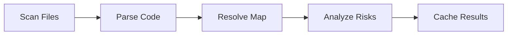

## What is Envark?

Envark is a powerful environment variable guardian that combines static code analysis, risk assessment, and interactive tooling to catch configuration issues before they hit production. It works both as a standalone CLI tool with a beautiful terminal interface and as an MCP (Model Context Protocol) server that integrates with AI-powered IDEs.

<Note>
Envark performs pure static analysis - no data ever leaves your machine. All scanning, parsing, and risk analysis happens locally.
</Note>

## The Problem

Environment variables are the silent killers of production deployments:

- **Runtime crashes** from undefined variables with no defaults
- **Security leaks** from secrets committed in the wrong files  
- **Configuration drift** when .env files diverge across environments
- **Onboarding friction** when new developers don't know which variables to set
- **Dead code** from variables defined but never used

**Envark catches these issues before they hit production.**

## Key Benefits

<CardGroup cols={2}>
  <Card title="Multi-Language Support" icon="code">
    Parse JavaScript, TypeScript, Python, Go, Rust, Shell scripts, and Docker files with language-specific patterns
  </Card>
  
  <Card title="Risk Scoring" icon="shield-check">
    Automatic risk classification: Critical, High, Medium, Low, and Info levels with actionable recommendations
  </Card>
  
  <Card title="Fast & Cached" icon="bolt">
    Targets under 2 seconds for 500-file projects with intelligent caching to `.envark/cache.json`
  </Card>
  
  <Card title="AI Integration" icon="robot">
    Works as an MCP server with Claude, Cursor, VS Code, and Windsurf - plus built-in AI assistant
  </Card>
</CardGroup>

## Core Features

### Static Analysis

Envark recursively scans your codebase to:

- **Map all variables** - Track every environment variable usage and definition
- **Detect missing vars** - Find variables used in code but never defined
- **Find duplicates** - Identify conflicting definitions across .env files
- **Validate files** - Check .env files against actual code requirements
- **Generate templates** - Auto-create .env.example from your codebase

### Risk Analysis

Every variable gets a risk score based on:

<Steps>
  <Step title="Critical Risk">
    Used in code but never defined, with no default value - **will cause runtime crashes**
  </Step>
  
  <Step title="High Risk">
    Secret-like names (API_KEY, PASSWORD, SECRET) found in committed files instead of .env
  </Step>
  
  <Step title="Medium Risk">
    Multiple usages across files without defaults, or conflicting definitions
  </Step>
  
  <Step title="Low Risk">
    Undocumented in .env.example, or defined but never used (dead variables)
  </Step>
  
  <Step title="Info">
    Fully configured variables with proper documentation
  </Step>
</Steps>

### Interactive TUI

Envark includes a beautiful terminal interface inspired by modern security tools:

- **Command menu** with `/` prefix for all operations
- **Real-time scanning** with progress indicators
- **Color-coded output** for risk levels
- **Dropdown navigation** with keyboard shortcuts
- **AI assistant** for smart analysis and recommendations

<Tip>
Type `/` at any time to open the command dropdown and see all available commands.
</Tip>

### MCP Server Mode

When integrated with AI-powered IDEs, Envark exposes 9 powerful tools:

| Tool | Purpose |
|------|----------|
| `get_env_map` | Complete environment variable map with filtering |
| `get_env_risk` | Risk analysis sorted by severity |
| `get_missing_envs` | Variables that will cause runtime crashes |
| `get_duplicates` | Conflicting definitions across files |
| `get_undocumented` | Variables missing from .env.example |
| `get_env_usage` | Detailed usage tracking for specific variables |
| `get_env_graph` | Dependency graph visualization |
| `validate_env_file` | Validate .env against code requirements |
| `generate_env_template` | Auto-generate .env.example |

## Supported Languages

Envark understands environment variable patterns across multiple languages:

<CodeGroup>
```javascript JavaScript/TypeScript
process.env.DATABASE_URL
import.meta.env.VITE_API_KEY
```

```python Python
import os
os.environ['API_SECRET']
os.getenv('PORT', '3000')
```

```go Go
import "os"
os.Getenv("JWT_SECRET")
val, exists := os.LookupEnv("API_KEY")
```

```rust Rust
use std::env;
env::var("DATABASE_URL")
env::var("PORT").unwrap_or("8080".to_string())
```

```bash Shell
$DATABASE_URL
${API_KEY}
${PORT:-3000}
```

```docker Dockerfile
ENV NODE_ENV=production
ARG DATABASE_URL
```
</CodeGroup>

## How It Works

Envark uses a multi-stage pipeline:



<Steps>
  <Step title="Scanning">
    Recursively walks your project with intelligent filtering - respects `.gitignore`, skips `node_modules`, and uses smart depth limits
  </Step>
  
  <Step title="Parsing">
    Extracts environment variable usages using language-specific regex patterns for JavaScript, Python, Go, Rust, Shell, Docker, and .env files
  </Step>
  
  <Step title="Resolution">
    Links definitions (.env files) with usages (code) and documentation (.env.example) to build a complete variable map
  </Step>
  
  <Step title="Risk Analysis">
    Assigns risk scores based on usage patterns, missing definitions, secret detection, and documentation status
  </Step>
  
  <Step title="Caching">
    Results cached to `.envark/cache.json` with hash-based invalidation - only re-scans when files change
  </Step>
</Steps>

<Warning>
Envark targets Node.js 18.0.0 or higher. Make sure your environment meets this requirement before installation.
</Warning>

## Use Cases

### Pre-Deployment Checks

Run `envark risk critical` in your CI pipeline to catch missing variables before they cause production crashes.

### Onboarding New Developers

Generate an up-to-date `.env.example` with `envark generate` so new team members know exactly which variables to configure.

### Security Audits

Find hardcoded secrets and sensitive variables in committed files with `envark risk high`.

### Environment Validation

Validate your production .env file against code requirements: `envark validate .env.production`.

### Refactoring Safety

Before removing code, check if environment variables become dead: `envark scan unused`.

## What's Next?

<CardGroup cols={2}>
  <Card title="Installation" icon="download" href="/installation">
    Install Envark with npm, yarn, pnpm, or run instantly with npx
  </Card>
  
  <Card title="Quickstart" icon="rocket" href="/quickstart">
    Complete getting started guide from installation to your first scan
  </Card>
</CardGroup>