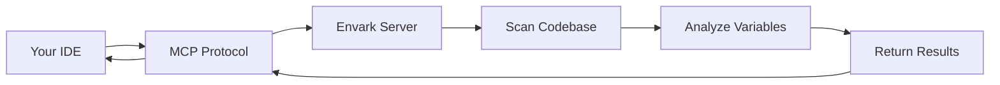

Envark works as an [Model Context Protocol (MCP)](https://modelcontextprotocol.io) server, enabling AI assistants like Claude, Cursor, VS Code Copilot, and Windsurf to analyze and manage your environment variables directly.

## What is MCP?

The Model Context Protocol is a standardized way for AI assistants to access tools and context from external systems. When you configure Envark as an MCP server, your AI assistant gains the ability to:

- **Scan** your entire codebase for environment variable usage
- **Analyze** risk levels and detect missing variables
- **Validate** `.env` files against actual code requirements
- **Generate** `.env.example` templates automatically
- **Track** variable dependencies and usage patterns

## Why Use Envark via MCP?

<CardGroup cols={2}>
  <Card title="Catch Issues Early" icon="triangle-exclamation">
    AI can proactively detect missing variables, security risks, and configuration drift before deployment
  </Card>
  <Card title="Faster Debugging" icon="magnifying-glass">
    Ask your AI "What environment variables are missing?" and get instant answers
  </Card>
  <Card title="Documentation Help" icon="book">
    AI can help keep your `.env.example` in sync with actual code usage
  </Card>
  <Card title="Security Analysis" icon="shield">
    Detect secrets in committed files and variables with security risks
  </Card>
</CardGroup>

## Supported IDEs

Envark integrates with all major AI-powered development environments:

| IDE | Support Level | Configuration |
|-----|--------------|---------------|
| **VS Code** | Full | `.vscode/mcp.json` |
| **Claude Desktop** | Full | `~/.claude/mcp.json` |
| **Cursor** | Full | `~/.cursor/mcp.json` |
| **Windsurf** | Full | `~/.windsurf/mcp.json` |

## Quick Start

<Steps>
  <Step title="Auto-configure for your IDE">
    Envark can automatically set up the MCP configuration for you:

    ```bash
    # VS Code
    npx envark init vscode

    # Claude Desktop
    npx envark init claude

    # Cursor
    npx envark init cursor

    # Windsurf
    npx envark init windsurf
    ```

    This creates the appropriate configuration file with the correct settings.
  </Step>

  <Step title="Restart your IDE">
    After configuration, restart your IDE or AI assistant to load the MCP server.
  </Step>

  <Step title="Test the integration">
    Ask your AI assistant:

    > "Can you scan my project for environment variables?"

    The AI will use Envark's `get_env_map` tool to analyze your project.
  </Step>
</Steps>

## Available Tools

When configured as an MCP server, Envark exposes 9 powerful tools to AI assistants:

<CardGroup cols={3}>
  <Card title="get_env_map" icon="map" href="/mcp/tools#get_env_map">
    Complete environment variable inventory
  </Card>
  <Card title="get_env_risk" icon="triangle-exclamation" href="/mcp/tools#get_env_risk">
    Risk analysis with severity levels
  </Card>
  <Card title="get_missing_envs" icon="circle-xmark" href="/mcp/tools#get_missing_envs">
    Variables that will cause crashes
  </Card>
  <Card title="get_duplicates" icon="copy" href="/mcp/tools#get_duplicates">
    Conflicting definitions finder
  </Card>
  <Card title="get_undocumented" icon="file-slash" href="/mcp/tools#get_undocumented">
    Variables missing from .env.example
  </Card>
  <Card title="get_env_usage" icon="magnifying-glass-chart" href="/mcp/tools#get_env_usage">
    Deep dive into specific variables
  </Card>
  <Card title="get_env_graph" icon="diagram-project" href="/mcp/tools#get_env_graph">
    Dependency graph visualization
  </Card>
  <Card title="validate_env_file" icon="check" href="/mcp/tools#validate_env_file">
    Validate .env files against code
  </Card>
  <Card title="generate_env_template" icon="file-code" href="/mcp/tools#generate_env_template">
    Auto-generate .env.example files
  </Card>
</CardGroup>

## Example Conversations

Once configured, you can ask your AI assistant natural questions:

<CodeGroup>
```text Security Check
"Are there any environment variables with security risks?"

AI uses: get_env_risk
Result: Lists critical/high risk variables with recommendations
```

```text Find Missing Variables
"What environment variables am I missing?"

AI uses: get_missing_envs
Result: Shows variables used in code but not defined
```

```text Validate Config
"Is my .env file valid?"

AI uses: validate_env_file
Result: Detailed validation report with issues and suggestions
```

```text Generate Template
"Generate a .env.example file for my project"

AI uses: generate_env_template
Result: Complete template with descriptions and placeholders
```
</CodeGroup>

## How It Works



1. **Your IDE starts** and loads the MCP configuration
2. **Envark launches** as a child process via `npx envark`
3. **AI assistant requests** analysis using MCP tools
4. **Envark scans** your codebase and returns structured data
5. **AI formats** the results in human-readable format

## Performance

- **Caching**: Results are cached in `.envark/cache.json` with smart invalidation
- **Speed**: Targets < 2s for 500-file projects
- **Private**: Pure static analysis, no data leaves your machine

## Next Steps

<CardGroup cols={2}>
  <Card title="Setup Guide" icon="gear" href="/mcp/setup">
    Detailed configuration for each IDE
  </Card>
  <Card title="Tool Reference" icon="wrench" href="/mcp/tools">
    Complete documentation of all MCP tools
  </Card>
</CardGroup>
